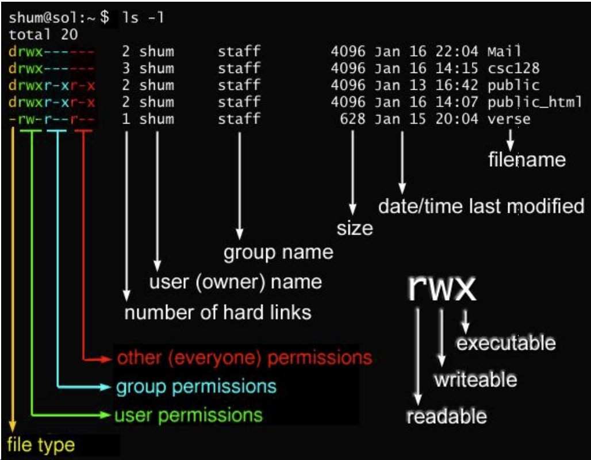
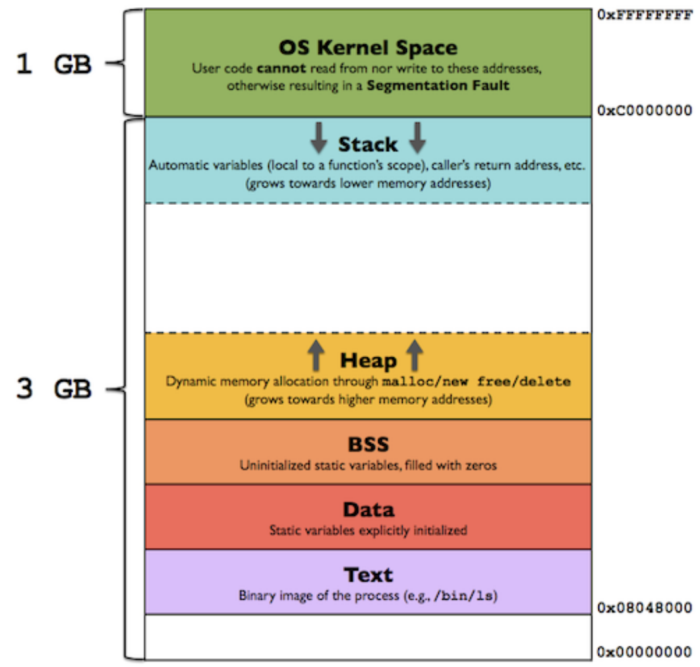
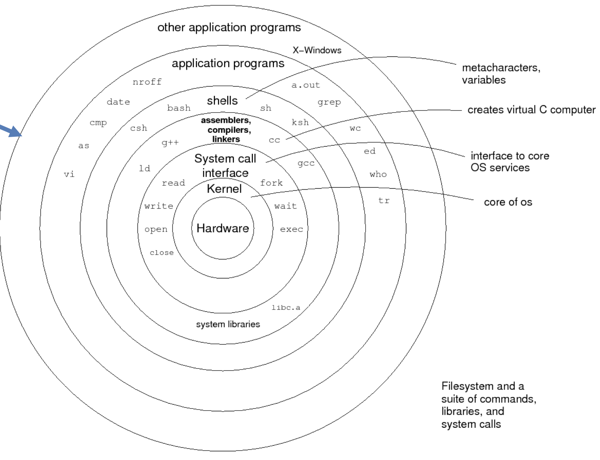
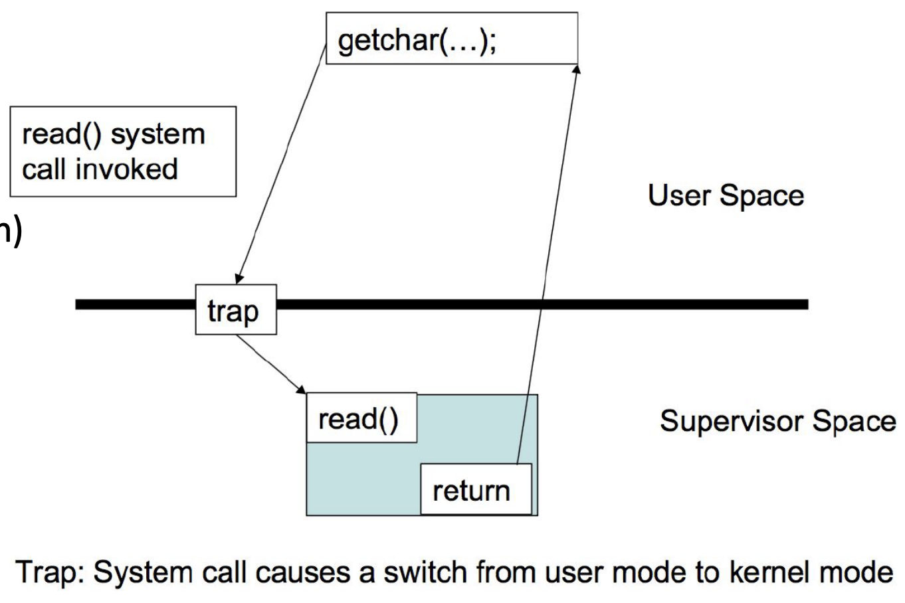
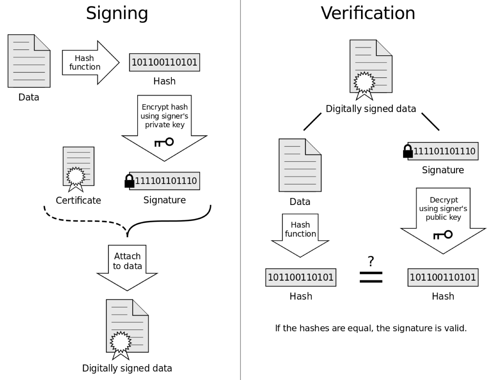

##Week 1
###Basic Shell Commands
* `man`: format display manual pages

    * `-k` same as the command `apropos` which searches the `whatis` database by string
* `cat`: concatenate and print files `cat <file>`
* `head`: display first lines of files `head [-n <count> | -c <bytes>] [file ...]`
    * `-n`: number of lines
    * `-c`: number of bytes
* `tail`: display the last part of a file `tail [-n <count> | -c <bytes>]`

    * You can tail multiple files. 
* `du`: display disk usage statistics `du -h <file>`

    * `-h`: human readable form 
* `ps`: process status
* `kill`: terminate or signal a process `kill [-s signal_name] pid ...`
* `diff`: compare two files line by line `diff <file1> <file2>`; "how to change the first file to make it match the second?"
   * traditional (no arguments)
    ```
    file1
    -------------------------------
    I need to buy apples.
    I need to run the laundry.
    file1
   
    file2
    -------------------------------
    I need to buy apples.
    I need to DO the laundry.
    file2
   
    $ diff file1 file2
    2c2
    < I need to run the laundry. 
    ---
    > I need to DO the laundry.
    ```
        * `<`: lines unique to `file1`
        * `>`: lines unique to `file2`
        * `2,3c2,3`: lines 2 to 3 from file 1 and lines 2 to 3 from file 2 have been changed
        * `2a3`: after line 2 in the first file a lines needs to be added
        * `4d3`: delete line 4 in the first file so the files are the same
    * `-u`: unified diff, same as `git`
    ```diff
    1. diff --git a/bootstrap.sh b/bootstrap.sh
    2. index e98ae1c..9073c4d 100644
    3. --- a/bootstrap.sh
    4. +++ b/bootstrap.sh
    5. @@ -1,6 +1,6 @@
    6.  #!/usr/bin/env bash
    7.  
    8. -apt-get update
    9. +sudo apt-get update
    10.  
    11.  wget -qO- https://raw.githubusercontent.com/...  
    12.  
    13. @@ -9,3 +9,4 @@ echo "source /home/vagrant/.nvm/...  
    14.  source /home/vagrant/.profile  
    15.  
    16.  nvm install node  
    17. +nvm alias default node
    ```
        * `@@`" start and end of a new hunk
        * `-1,6`: original file starting on line 1 had 6 lines before the `diff` was applied
        * `+1,6`: modified file starting on line 1 has 6 lines after `diff` is applied
        * line 6 and 7 are whitespace and remain unchanged
        * `-`: a deletion on original file
        * `+`: an add on the modified file
        * `'...'`: stayed the same 
    * `-y`: output in two columns
* `ls`: list contents of directory
    * `-d`: only directories
    * `-a`: all, including hidden ones
    * `-l`: long listing, including permission info
    * `-s`: show size of each file in blocks
    
* `chmod`: change file modes or Access Control Lists
    * `u`ser, `g`roup, `o`thers & `a`
    * `r`ead, `w`rite & e`x`ecute
    * `7`: `rwx`, `6`: `rw`, `5`: `rx`, `4`: `r`, `3`: `wx`, `2`: `w`, `1`: `x` & `0`: none
    * `+` add permission, `-` remove permission, `=` set to exact mode 
        * `chmod o=x structs`: Give `others` the executable permission alone.
        * `chmod +x structs`: Give `all` the ability to execute.
        * `chmod 777 structs`: Give `all` the ability to read, write and execute.
    * Special permissions
        * `o+t`: Lock files within the directory from being modified/deleted by users other than	the file creator, owner of the directory, or root, even	if others have write permissions.
        * `u+s`: Set userid upon execution.
        * `g+s`: Run an executable with the permissions of the executable's owner or group.
* `find <dir> [options]`: walk a file hierarchy
    * `-type <type>`: type of file; `-f` for file, `-d` for directories
    * `-perm <permBits>`: permission of file; `find sandbox -perm 644`
    * `-name <nameOfFile>`
    * `-prune`: don't recurse
    * `-o`: or; `find sandbox -depth 3 -o -name tmp`
    * `-ls`: list current file (`ls -l` command output) as `find` walks directories 
###Shortcuts
* `!!`: Replace with previous command.
* `![str]`: Refer to previous command with `str`.
* `^st1^str2`: Replace `str1` with `str2`for the last command.
###`.bashrc` vs `.bash_profile`
* `.bashrc`: executed for interactive non-login shells
    * e.g. `sh`
    * e.g. `bin/bash`
* `.bash_profile` executed for login shells
* `export PATH="$PATH:/some/addition"`
    * `.bashrc`: `/some/addition` would	get tacked on to the end of the PATH repeatedly
    * `.bash_profile`: `/some/addition` only added on once
* `top`: information about running processes
* `$0`: which shell you are using
* `touch <file>`: if file exists update access and modification time to current time; else an empty file is created.
    * `-t <timeStamp>`: change access and modification time to `timeStamp`; e.g. `touch -t 201101311759.30 file` changes access time to 2011, January, 31st at 17:59:30 
###`wh` Commands
`what`: How what versions of object modules were used to construct a file?
`whatis`: Search the `whatis database` for complete words.
`whereis`: Locate programs.
`which`: Locate a program file in the user's path.
`while`: Execute script repeatedly as long as a condition is met.
`who`: Display who is logged in.
`whoami`: Display effective user ID.
`whois`: Internet domain name and network number directory service

###File vs Process
* File: A named collection of related data that appears that appears to the user as a single continuous block of information.
* Process: A file that is compiled to an executable and being run.

##Week 2
###Environment Variables
* Locale gives cultures specific data. `locale` prints out locale data. Locale variables begin with 'LC'.
    * e.g. The collate variable specifies sorting order. Default is `LC_COLLATE="en_US.UTF-8"`
###Basic I/O Redirection
* `stdin` read from standard input 
* `stdout` write to standard output
* `stderr` write to standard error
stdin --> Program --> stdout
&nbsp;&nbsp;&nbsp;&nbsp;&nbsp;&nbsp;&nbsp;&nbsp;&nbsp;&nbsp;&nbsp;&nbsp;&nbsp;&nbsp;&nbsp;&nbsp;&nbsp;&nbsp;&nbsp;&nbsp;&nbsp;|--> stderr
* `> file`: redirect stdout to file
* `< file`: get input fro file
* `>> file`: to append stdout to file
* `2> file`: to redirect stderr to file 
* `2>&1 >/dev/null`: redirect `stderr` to `stdout` — the pipe; then redirect `stdout` to `/dev/null`
* `echo`: a simple print command
* `command_1 | command_2`:
    e.g. `ls | head -4 | tail -3` Read the 2nd to 4th line inclusive

###`grep` Commands
* `grep [option] [pattern]` pattern refers to regex
* `egrep` extended regex expressions same as `grep -E` and `sed -r`
* `fgrep` Fast grep that matches fixed strings instead of regular expressions, same as `grep -F`

###Web Commands
* `wget <URL>` is a tool to download files from servers
    * `-O <fileName>`: save downloaded file with `fileName`
* `curl <url>` is a tool that let's you exchange requests/responses with a server
    * `-o <fileName>`: save dowloaded file with `fileName`

###Comparison Commands 
* `comm file1 file2` compare sorted files; prints output in 3 columns
    * `-1` suppress lines only in `file1`
    * `-2` suppress lines only in `file2`
    * `-3` suppress lines common to bothe files
* `cmp file1 file2` compare files byte by byte; stops when it encounters first byte that is not different


###`ln` Command
* Hard link: A hard link is merely an additional name for an existing file. Any number of hard links, and thus any number of names, can be created for any file. Hard links can also be created to other hard links. However, they cannot be created for directories, and they cannot cross filesystem boundaries or span across partitions.
* Symbolic (soft) link: A symbolic link does not contain the data in the target file. It simply points to another entry somewhere in the file system. Symbolic links give the ability to link to directories, or to files on remote computers. Symbolic link point to `inode` that contains the path to the original file. They have an extra level of abstraction. When the original file is deleted, this path is not updated.
* When you delete a target file, symbolic links to that file become unusable, whereas hard links preserve the contents of the file.
* Both soft and hard links can be used to edit files.

###Text Processing Commands
* `sort`
    * `-b` ignore leading blanks
    * `-d` consider only blanks and alphabets
    * `-r` reverse the results of comparison
    * `-u` for duplicate records, only output one record
    * `-g` for sorting floating points 
    * `--parallel=<numThreads>` Use `numThreads` to sort.
* `wc` word count
    * `-l` counts number of lines
    * `-c` number of bytes
* `head` get the top lines; `-n` specifies number of lines to get
* `tail` get the bottom lines
* `tr [OPTION]... SET1 [SET2]` replace elements in `set` with corresponding elements from set2
    ```sh 
    echo "abc" | tr [:lower:] [:upper:]
    echo "a1b2c3" | tr -d [:digit:] #delete digits from output 
    echo "aaa13334" | tr -s a3 #remove duplicate chars a and 3. -s or --squeeze-repeats replaces each input sequence of a repeated character that is listed in SET1 with a single occurrence of that character
    echo "a1b2c3" | tr -dc [:digit:] #remove everything except digits; -c stands for complement
    ```
* `awk [options] [program file]`

    * -F fs: To specify file separator
    * -f file: To specify path to `awk` script
    * Columns: `$0`-whole line, `$1`-first column, `$n`-nth column
* `sed`: stream editor
    * basics
    ```sh
    sed -n '1p' file   #print line 1
    sed -n '1,5p' file #print lines 1 to 5
    sed -n '1~5p' file #print lines 1 and 5
    ```
    * delete lines from STDIN that contain some characters ( in this case, lines that contain characters OTHER THAN pk ' m n w l h a e i o u ')
    ```sh
    cat filey | sed "/[^pk'mnwlhaeiou]/d"
    ```
    * delete blank lines
    ```sh
    cat filey | sed '/^$/d'
    ```
    * find and replace

    ```sh
    cat filey | sed 's/hello/whatsup/g' # change hello to whatsup
    ```
    * multiple find and replaces
    ```sh
    cat filey | sed -e 's/hello/whatsup/g' -e 's/yello/yo/g' # change hello to whatsup, yello to yo
    ```
    * Replace the first occurrence of a string in a file, and print the result:
    ```sh
    sed 's/find/replace/' filename
    ```
    * Replace all occurrences of an extended regular expression in a file:
    ```sh
    sed -E 's/regex/replace/g' filename
    ```
    * Replace all occurrences of a string in a file, overwriting the file (i.e. in-place), but keeping a backup with the same filename, but with an extra `extension`:
    ```sh
    sed -i 'extension' 's/find/replace/g' filename
    ```
    * Replace only on lines matching the line pattern:
    ```sh
     sed '/line_pattern/s/find/replace/' filename
    ```
    * Replace separator `/` by any other character not used in the find or replace patterns,
    ```sh
    sed 's#find#replace#' filename
    ```
###Regular Expression ~ Query
* data stream --> regex --> filtered data

   				|--> rejected data

* Nice [markdown](https://github.com/ziishaned/learn-regex) 
|Meta character|Description|
|:----:|:---|
|.|Period matches any single character except a line break.|
|[ ]|Character class. Matches any character contained between the square brackets.|
|[^ ]|Negated character class. Matches any character that is not contained between the square brackets|
|*|Matches 0 or more repetitions of the preceding symbol.|
|+|Matches 1 or more repetitions of the preceding symbol.|
|?|Makes the preceding symbol optional.|
|{n,m}|Braces. Matches at least "n" but not more than "m" repetitions of the preceding symbol.|
|(xyz)|Character group. Matches the characters xyz in that exact order.|
|&#124;|Alternation. Matches either the characters before or the characters after the symbol.|
|&#92;|Escapes the next character. This allows you to match reserved characters <code>[ ] ( ) { } . * + ? ^ $ \ &#124;</code>|
|^|Matches the beginning of the input.|
|$|Matches the end of the input.|

* Examples
  * Postive look ahead: `(T|t)he(?=\sfat)` => **The** fat cat sat on the mat. 
  * Postive look behind and ahead: ` (?<=^|\s)([a-zA-Z0-9,]+|,)(?=[\s\.\?\!])` => **Apple, banana** & **orange**.
  * Negative look a`(T|t)he(?!=\sfat)"` => The fat cat sat on **the** mat.
  * Greedy vs Lazy match
    * Greedy match: `/(.*at)/` => The **fat cat sat on the mat**.
    * Lazy match: `/(.*?at)/` => The **fat** cat sat on the mat. 
  * Global search
    * Non-global search (stop after first match): `/.(at)/` => The **fat** cat sat on the mat.
    * Global match: `/.(at)/g` => The **fat cat sat on the mat**.

###Shell Scripting
* Must specify the shell you want to use
  `#!/bin/bash`
* Variables
    * Environment variables: 
    ```bash
    pwd #print working directory
    export a=4
    echo $a
    env #Shows current environment
    ```
    * User defined variables:
    ```bash
    a=5 #no spaces 
    echo $a
    unset #remove variable and functions defined by the user
    ```
    * Special variables
        * `$0`: file name
        * `$n`: number of input variables
        * `$1 ... $n`: input variables
          ```bash
          #Looping over input arguments to a shell script
          for var in "$@" #"$@" holds all the input variables
          do
              echo "$var"
          done
          ```
        * `$?`: exit code of the previous program
    * Arithmetic operations
        * `let a=3`: Let only works for numbers
        * Use `((a++))` (double brackets) to perform arithmetic or logic
    * Quotes
        * Single quote `'`: literal value
        * Double quote `"`: literal value of everything except `$` and `/`
        * Backtick `` ` ``: evaluate the command get output. Same as `$()`
* if-elif-else
    ```bash
    if [ command ] #same as "test command"
    #command is bash command not some variable like true or false
    then
    #Your logic here
    fi
    ```
* `test` command
    ```sh
    if [ -e /etc/passwd ]; then
        echo "Alright man..." >&2
    fi
    #Same as ...
    if test -e /etc/passwd; then
        echo "Alright man..." >&2
    fi
    ```
* Comparison
    * Square brackets: 
    `if [ "$x" -eq "5" ]` do we need to quote? YES!
    * Circle brackets: Mathematical context
      `if ((x==5))`
| Primary                     | Meaning                                                                                                                                                                                                                                                     |
|:-----------------------------|:-------------------------------------------------------------------------------------------------------------------------------------------------------------------------------------------------------------------------------------------------------------|
| [ -a FILE ]                 | True if FILE exists.                                                                                                                                                                                                                                        |
| [ -b FILE ]                 | True if FILE exists and is a block-special file.                                                                                                                                                                                                            |
| [ -c FILE ]                 | True if FILE exists and is a character-special file.                                                                                                                                                                                                        |
| [ -d FILE ]                 | True if FILE exists and is a directory.                                                                                                                                                                                                                     |
| [ -e FILE ]                 | True if FILE exists.                                                                                                                                                                                                                                        |
| [ -f FILE ]                 | True if FILE exists and is a regular file.                                                                                                                                                                                                                  |
| [ -g FILE ]                 | True if FILE exists and its SGID bit is set.                                                                                                                                                                                                                |
| [ -h FILE ]                 | True if FILE exists and is a symbolic link.                                                                                                                                                                                                                 |
| [ -k FILE ]                 | True if FILE exists and its sticky bit is set.                                                                                                                                                                                                              |
| [ -p FILE ]                 | True if FILE exists and is a named pipe (FIFO).                                                                                                                                                                                                             |
| [ -r FILE ]                 | True if FILE exists and is readable.                                                                                                                                                                                                                        |
| [ -s FILE ]                 | True if FILE exists and has a size greater than zero.                                                                                                                                                                                                       |
| [ -t FD ]                   | True if file descriptor FD is open and refers to a terminal.                                                                                                                                                                                                |
| [ -u FILE ]                 | True if FILE exists and its SUID (set user ID) bit is set.                                                                                                                                                                                                  |
| [ -w FILE ]                 | True if FILE exists and is writeable.                                                                                                                                                                                                                        |
| [ -x FILE ]                 | True if FILE exists and is executable.                                                                                                                                                                                                                      |
| [ -O FILE ]                 | True if FILE exists and is owned by the effective user ID.                                                                                                                                                                                                  |
| [ -G FILE ]                 | True if FILE exists and is owned by the effective group ID.                                                                                                                                                                                                 |
| [ -L FILE ]                 | True if FILE exists and is a symbolic link.                                                                                                                                                                                                                 |
| [ -N FILE ]                 | True if FILE exists and has been modified since it was last read.                                                                                                                                                                                           |
| [ -S FILE ]                 | True if FILE exists and is a socket.                                                                                                                                                                                                                        |
| [ FILE1 -nt FILE2 ]         | True if FILE1 has been changed more recently than FILE2, or if FILE1 exists and FILE2 does not.                                                                                                                                                             |
| [ FILE1 -ot FILE2 ]         | True if FILE1 is older than FILE2, or is FILE2 exists and FILE1 does not.                                                                                                                                                                                   |
| [ FILE1 -ef FILE2 ]         | True if FILE1 and FILE2 refer to the same device and inode numbers.                                                                                                                                                                                         |
| [ -o OPTIONNAME ]           | True if shell option OPTIONNAME is enabled.                                                                                                                                                                                                                 |
| [ -z STRING ]               | True of the length if STRING is zero.                                                                                                                                                                                                                       |
| [ -n STRING ] or [ STRING ] | True if the length of STRING is non-zero.                                                                                                                                                                                                                   |
| [ STRING1 == STRING2 ]      | True if the strings are equal. = may be used instead of == for strict POSIX compliance.                                                                                                                                                                     |
| [ STRING1 != STRING2 ]      | True if the strings are not equal.                                                                                                                                                                                                                          |
| [ STRING1 < STRING2 ]       | True if STRING1 sorts before STRING2 lexicographically in the current locale.                                                                                                                                                                               |
| [ STRING1 > STRING2 ]       | True if STRING1 sorts after STRING2 lexicographically in the current locale.                                                                                                                                                                                |
| [ ARG1 OP ARG2 ]            |  |


>OP is one of -eq, -ne, -lt, -le, -gt or -ge. These arithmetic binary operators return true if ARG1 is equal to, not equal to, less than, less than or equal to, greater than, or greater than or equal to ARG2, respectively. ARG1 and ARG2 are integers. e.g [$ $! -gte "150"]  exp -a exp1: and, exp -o exp1: or, !expr: not & (exp): returns value of expression.


* Loops
    * `for`
    ```sh
    for i in $(ls); do
        echo item: $i
    done
    ```
    * `for` C-style
    ```sh
    for i in `seq 1 10`;
    do
            echo $i
    done    
    ```
    * `for` {}-style
    ```sh
    for i in {1..20}
    do
        echo "$i"
    done
    ```
    * `for` (())-style
    ```sh
    for (( i=1; i<=5; i++ ))
    ```
    * `while` 
    ```sh
    COUNTER=0
    while [  $COUNTER -lt 10 ]; do
        let COUNTER=COUNTER+1 
    done
    ```
    * `until`
    ```sh
    COUNTER=20
    until [  $COUNTER -lt 10 ]; do
        let COUNTER-=1
    done
    ```
* Functions
    ```sh
    print_something () {
        echo Hello $1
    }
    print_something Mars
    ```
* Reading from a file
    ```sh
    while read -r line; do
        echo $line
    done < $file
    ```
* `seq` command to generate sequences
  *Note the output is newline seperated and not space seperated. The below is a sample*

  * `seq 1`: `1`
  * `seq 1 2`: `1 2`
  * `seq -1 1`: `-1 0 1`
##Week 3
### `tar`
* `tar -xzvf filename.tar.gz`
    * `-x`: extract file
    * `-z`: for gzip files
    * `-v`: verbose (print contents of file)
    * `-f`: supply file argument
    * `-c`: to compress; cannot use in conjuction with `-x`

### `gcc`
* `g++ -Wall *.cpp -o <executable>`
* `-c`: generating object code for a file saves on compilation time; so if you just change one of the header files in one of you source code files, you do not need to recompile all the files.
* `-static`: Create static libraries
* `-shared`: Create shared libraries
* `-I <dir>`: additional directory to search for header files
* `-L <dir>`: additional directories to search for libraries to link to
* `-l <additionalLib>`: name of additional library to link with 
* `-fpic`: Output position independant code; REQUIRED for SHARED LIBRARIES
  
## `ldd`
* Use `ldd` to know which dynamic libraries program is using

### Compilation Process
1. source code files 
    * *header files included*
    * **C++ preprocessor**
2. expanded source file
    * **compiler**
3. .s assembler file
    * **assembler**
4. .o object code file (unlinked machine code)
    * *object code for library functions* 
    * can also have *.a archive files* which are collections of *.o files*
    * **linker** (static linking)
5. executable file (binary or machine code that CPU can execute)

###`./configure`
* Script that checks details about the machine before installation
* Creates `Makefile`

###`make`
```makefile
CC = gcc
CFLAG = -Wall -g
all: shop #when you run 'make'
#Rule for shop
shop: item.o shoppingList.o shop.o #item.o etc are targets, so 'make' will make them first, these are the prerequisites
    $CC $CFLAG -o shop item.o shoppingList.o shop.o
item.o: item.cpp item.h
    $CC $CFLAG -g -c item.cpp #'-c' => compile to .o file; '-g' generate debugging information
#Rules for shoppingList.o and shop.o go HERE
install: shop
    install -m +x shop /some/dir/in/PATH #'-m +x' makes the binary executbale
clean: #when you run 'make clean'
    rm -f *.o *.so shop
```

### Applying `patch`
* Generate patch with `diff -u <oldFile> <newFile> > <file>.patch`
* Apply patch by `patch -p[num] < <file>.patch`
    * `num`: *strip* the smallest number prefix containing `num` leading slashes from each file name found in the patch file

* What triggers make?
    * Target does not exist
    * Prerequsites are newer than already made targets; `make` will compare the time at which the requistie files where modified and proceed as necessary.

###`awk`
```bash
BEGIN {
    FS=":"; #This is the field sepertor => how to delimit input; same as `-F=":"`
    print "Executed once at the start";
}
{
    #NF and NR start at 1 and not 0!
    #NF is the number of fields
    if ( NR != 1 ){ #Print everything except the first row
        for ( i = 1; i <= NF; i++ ){
            print $i
        }
    }
}
END {
    #NR is the number of rows
	print "Number of rows: ", NR;
    print "Executed once at the end";
}
```
* Use `-f` to provide a file as input
* `print $0` will print the whole row

###`python`
* Governed by indentation
* Pass by value vs reference? (Mutablity vs Immutability)
    * Binding a variable in `python` means setting a name to hold a reference to some object.
    * Primitive types such as integers, floats, strings, character and boolean are immutable.
    * Properties of objects passed to functions can be modified. You can also modify memebers of lists that are passed in. 
    * You CANNOT reassign the passed in variable entirely.
* Boolean: `True` and `False`
* Tuple: `t = (1,2,3)`; `t` is IMmutable. 
    * However, `t` can be reassigned: `t = (4,5)`
    * Conversion from `list`: `t = tuple(someList)`
* List: `l = [1,2,3]`; `l` is mutable
    * Converstion from `tuple`: `l = list(someTuple)` 
    ```python
    #Basics:
    li = [1,2,3]
    li.append('a') #'li' --> [1,2,3,'a']
    li.insert(2,'i') #'li' --> [1, 2, 'i', 3, 'a']
    li.extend(["hello", "world"])#'li' -->[1, 2, 'i', 3, 'a', 'hello', 'world']
    #extend creates a new memory reference
    li += [4,5] #'li' --> [1, 2, 'i', 3, 'a', 'hello', 'world', 4, 5]
    #'+' opperates in place, NO new memory reference created
    li.index('4') # 7
    #'index' gives first occurence of element in list
    li.remove('4') #'li' --> [1, 2, 'i', 3, 'a', 'hello', 'world', 5]
    #'remove' removes the first occurence of element in list
    li.reverse() #'li' --> [5, 'world', 'hello', 'a', 3, 'i', 2, 1]
    #'reverse' reverses IN PLACE
    li.sort() #'li' --> [1, 2, 3, 5, 'a', 'hello', 'i', 'world']
    #'sort' sorts IN PLACE
    li.sort(my_sort_func)
    #`my_sort_func` must taken two values and return an integer
    #Copying lists:
    li2 = li[:] #slice whole list
    li2 = li.copy()
    li2 = list(li)
    li2 = copy.copy(li) #'import copy'
    li2 = copy.deepcopy(li)
    #Slicing
    #if syntax is wrong, empty list is returned
    li[st:end] #slice from st:end-1 inclusive
    li[st:] #slice from st
    li[:end] #slice from 0 to end -1 inclusive
    li[-2:] #last two elements in the array
    li[:-2] #everthing except the last two elements
    li = [1,2,3]
    li[2:3] = [1] #'li' -> [1,2,1]
    li[start:end:step] #slice from start to end-1 (inclusive) skipping by step
    #'li' --> ['world', 'i', 'hello', 'a', 5, 3, 2, 1]
    # 'li[::4]' --> ['world', 5]
    li[::-1] #reverses the list
    li[1::-1]   #the first 2 items, reversed
    #same as li[:2][::-1]
    li[:-3:-1]  #the last 2 items, reversed
    li[-3::-1]  #everything except the last 2 items, reversed
    #Comprehensions
    h_l = [ l for l in 'human' ] #'h_l' -> ['h', 'u', 'm', 'a', 'n']
    n_l = [y for y in range(2)] #'n_l' --> [0, 1]
    ```
* Dictionary: essentially hash table; supports key-value pair storage
    ```python
    d = {} #initialize to empty dictionary
    d = {"user":"sketch", "pass" : "1234"}
    d["pass"] #'1234'; Note: single and NOT double quotes was used
    d["id"] = 42 #'d' --> {'id': 42, 'user': 'sketch', 'pass': '1234'}
    del d["id"] #'d' --> {'user': 'sketch', 'pass': '1234'}
    d.clear() #'d' --> {}
    d = {"user":"sketch", "pass" : "1234"}
    d.keys() #['user', 'pass']
    d.values() #['sketch', '1234']
    d.items() #[('user', 'sketch'), ('pass', '1234')]
    ```
* Control flows:
    ```python
    #if-elif-else
    if x == 3:
        print "equal 3"
    elif x == 2:
        print "equal 2"
    else
        print "equal", x
    #assert
    assert(x < 3) #throws error if assetion fails
    #while
    while x < 10:
        if x > 2:
            print "a"
        continue
        print "b"
        if x == 9:
            break
    ```
* Functions
    ```python
    #'*arg' represents unlimited args; '**kwargs' represents unlimited key-value store
    a=1
    def manyArgs(a, b=None, *args, **kwargs):
        global a #this means you are referring to global variable 'a' and not the one from the argument
        print "a:", a
        print "b:", b
        print len(args)
        print len(kwargs)
        return args, kwargs
    '''
    'manyArgs(0,2,4,4,4,d=2,e=4)'
    a: 1
    b: 2
    3
    2
    return: ((4, 4, 4), {'d': 2, 'e': 4})
    '''
    ```
* Imports
    ```python
    from module import function as alias
    import module 
    import module2 as md2
    module.function()
    md2.function()
    ```
* OOP
    ```python
    class Employee:
        empCount = 0
        def __init__(self, name, salary):
            self.name = name
            self.salary = salary
            Employee.empCount += 1
        def displayCount(self):
            print "Total Employee %d" % Employee.empCount
    class Boss(Employee):
        salary = 0
    ```
* `try, except, finally`
    ```python
    try:
        1/0
    except:
        print("that was silly")
    finally:
        print("this gets executed no matter what")
    ```
* File I/O
    ```python
    '''
    play.txt
    Hello
    World
    '''
    fileptr = open("play.txt")
    print "read:", fileptr.read()
    for line in fileptr:
        print line
    fileptr.close()
    '''
    read: Hello
    World

    '''
    ```

##Week 4
###Python Reference Semantics
* Assignment example: `x = 3`
    1. Integer `3` is created and stored in memory
    2. A name `x` is created
    3. A reference to the memory location of `3` is assigned to `x`
    ````
    name_list | memory
        ↓________↑
    ````
* Addition example: `x+=1`
    1. The reference of name x is looked up
    2. The value is retreived
    3. `3+1=4` is calculated and assigned to FRESH memory
    4. The name `x` is changed to point to this FRESHly allocated memory
    5. `3` is garabage collected

###Python 2 vs Python 3
> All examples so far where for python 2.X
* Division: Python 2: `2/3 = 0`; Python 3 `2/3 = 0.6...`
* `print` requires paranthesis in Python 3
* `xrange` is `range` in Python 3; `range` from Python 2 not continued

    * `xrange` is a generator function; `range` allocates a fix sized chunk in memory
* Transition: `from __future__ import division` will make `2/3 = 0.6...` in Python 2
* Error handling as required in Python 3 available
    ```python
    try:
        1/0
    except Exception as e: #the as keyword is required in Python3
    #except Exception, e: #python2 syntax
        print(e)
    ```

##Week 5
###Program Process Layout

* Text: Contains Machine instructions to be executed
* Heap: Dynamic memory --> allocation and freeing 
* Stack: Stores local variables, return addresses and registers
    * When function is invoked, it is pushed into the stack
    * When function returns, it is popped from the stack
* Analyzing with GDB:
    * `backtrace`,`bt`: Shows the call trace
    * `info frame`: Information about current stack frame including its return address and saved register values
    * `info locals`: Local varaiables of the function
    * `info args`: List of arguments to the function call
    * e.g. `printf "%s", x`: prints the value of the `x` as a string
    * `list <fileName>: <lineNumber>`, `list <functioName>`, `list`: more lines of source code than the previous call to `list`

###C vs. C++
* C: A subset of C++
* C does not support:
    * OOP: Inheritance, polymorphism etc.
        * C structs cannot have memeber functions
        * C does not have `private`, `public` & `friend` access specifiers
        * C structs don't have constructors   
    * `new` and `delete` based automatic memory allocation
    * Implicit return of `0` by `main`

##Week 6

###Processor Modes
>Mode bit is used to keep track of whether the processor is in user or kernel mode. I/O instructions are protected; if an application needs I/O then the OS needs to do to execute them on its behalf. Executing these instructions requires a privellage as they can change the protected state of the OS.
* Kernel (Supervisor) mode: processor is able to execute every instruction in the hardware
    * Code can access any memory address and any hardware resources
    * If a program crashes, the entire system will be halted
* User mode: can only execute a subset of these instructions.
    * No direct access to memory and hardware resources.
    * If program crashes, only the crashed program will be halted.

###System Call Interface
>A safe way to expose privellaged functionality to the user. The only way a program running in user mode can perform privellaged actions. Temproarily changes CPU to kernel mode after verifying the user has permission to perform the required action. 


* System call execution:
    1. System call cause a `trap` that interupts the execution of the process. OS saves its state.
    2. Kernel takes control of the processor. User mode --> Kernel mode. OS may load large data structures into memory.
    3. Kernel executes the system call. If necessary, the data structures will be copied over to the user program's memory.
    4. OS restores saved context. User process gets control back of the processor. It has the return value from the system call.
> Stack interpretation: in steps 1-3: parameters are pushed on to the stack, then code for system call is put on registers, a number is associated with each system call and the system call interface invokes the intended system call in the OS kernel. Increment stack pointer.
* Examples
```c
#include <unistd.h> //for sys-calls
#include <fcntl.h> //for access modes
#include <errno.h> //declares errno which holds the error code of the last error
#include <string.h> //for strerror()
#include <sys/stat.h> //for fstat
#include <sys/types.h> // fot struct stat

ssize_t read (int fildes, void *buf, size_t nbyte); //returns number of bytes read
//filedes: file descriptor: 0, 1 or 2
ssize_t write(int fildes, const void *buf, size_t nbyte); //returns number of bytes written
int open(const char *pathname, int flags, mode_t mode); //if return values less than 0, 
/*Modes:
O_RDONLY: Open for reading only.
O_RDWR: Open for reading and writing.
O_WRONLY: Open for writing only.
O_CREAT: Create file if it does not exist.
*/
int close(int fd); //returns zero on success. On error, -1 
int fstat(int filedes, struct stat *buf); //returns file related information

int main(void) {
    int filedesc = open("testfile.txt", O_WRONLY | O_APPEND);
    if (filedesc < 0) {
        return -1;
    }
    struct stat buf;
    stat = fstat(int filedes, struct stat *buf); //returns file related information
    if (write(filedesc, "This will be output to testfile.txt\n", 36) != 36) {
        write(2, "There was an error writing to testfile.txt\n", 43);
        return -1;
    }
    if (close(filedesc) != 0) {
        printf("error closing testfile.txt %s\n", strerror(errno))
        return -1;
    }
    return 0;
}
```
* `stat` struct fields:
```
dev_t     st_dev     ID of device containing file
ino_t     st_ino     file serial number
mode_t    st_mode    mode of file (see below)
nlink_t   st_nlink   number of links to the file
uid_t     st_uid     user ID of file
gid_t     st_gid     group ID of file
dev_t     st_rdev    device ID (if file is character or block special)
off_t     st_size    file size in bytes (if file is a regular file)
time_t    st_atime   time of last access
time_t    st_mtime   time of last data modification
time_t    st_ctime   time of last status change
blksize_t st_blksize a filesystem-specific preferred I/O block size for
                     this object.  In some filesystem types, this may
                     vary from file to file
blkcnt_t  st_blocks  number of blocks allocated for this object
```
* Libabray functions: Wrappers around system calls; equivalent library functions make fewer system calls i.e. non frequent switches from user mode to kernel mode --> less overhead.
* 5 categories of system calls:
    1. Process control
    2. File management
    3. Device management
    4. Information Maintenance
    5. Communication

###Unuffered vs Buffered I/O
* Buffered output improves I/O perfomance and reduces system calls.
    * `stdout` is buffered as there is far more data going through it than `stderr`.
* Unbuffered output when you want to ensure that the output has been written before continuing.
    * `stderr` unbuffered as you want a gurantee that infrequent errors are communicated to users.

###`time`
`time <command>`
* `real`: Time elapsed according to a wall clock.
* `user`: The CPU time used by your process.
* `sys`: The CPU time used by the system on behalf of your process i.e. system calls.

###`strace`
>Intercept and print out system calls to `stderr` or to a file.
`strace –o <outputFile> <command> <args> < <input>`

##Week 7

###Uniprocessor vs. Muliprocessor
* Uniprocessing system: Runs on a single CPU core. Processor switches between multiple threads (`time sharing`). Parallelism is an illusion. 
* Multiprocessing system: Runs on multiple CPU core. 

###Multitasking vs. Multithreading
* Multitasking: Several processes are scheduled alternatively or possibly to simultaneouusly on a multiprocessing system.
    * Expensive creation/destruction of processes.
    * Expensive inter process communication.
    * An error in one process canNOT bring down other processes.
* Multithreading: Same job is broken down into logical pieces or threads which may be executed simultaneously on a multiprocessing system.
    * Cheap creation/destruction of threads.
    * Easy inter-thread communication.
    * An error in one thread CAN bring down all threads in the process.

###Threads
> Smallest unit of processing scheduled by OS. A `process` consists of atleast one thread.
* Personal resources: **stack**, registers & ID.
* Independant resources: code, **heap**, global data & OS Resources.
* Advantages: thread switches less expensive than process switches, inter thread communication via shared global data.
* Disadvantages: need synchronization amongst threads when reading/writing to the same data.

###pthread API
* Compile with `-lpthread` flag
```c
#include <stdio.h>
#include <stdlib.h>
#include <assert.h>
#include <pthread.h>
#include <unistd.h>

#define NUM_THREADS 5

void *perform_work(void *arguments){
  int index = *((int *)arguments);
  //Computation @Varun Pidugu's expertise
  printf("THREAD %d: Ended.\n", index);
}

int main(void) {
  pthread_t threads[NUM_THREADS];
  int thread_args[NUM_THREADS];
  int i;
  int result_code;
  //create all threads one by one
  for (i = 0; i < NUM_THREADS; i++) {
    printf("IN MAIN: Creating thread %d.\n", i);
    thread_args[i] = i;
    //intt pthread_create(pthread_t *tid, const pthread_attr_t *attr, void *(my_function)(void *), void *arg); arg can be NULL if no argument.	
    result_code = pthread_create(&threads[i], NULL, perform_work, &thread_args[i]);
    assert(!result_code); // result_code == 0 on success
  }
  //wait for each thread to complete
  for (i = 0; i < NUM_THREADS; i++) {
    // int pthread_join(pthread_t tid, void **status); status is NULL if you do NOT want to set the exit status of thread.
    result_code = pthread_join(threads[i], NULL);
    assert(!result_code);
  }
  return 0;
} 
```
* `void pthread_exit(void *value_ptr);`: The pthread_exit() function shall terminate the calling thread and make the value value_ptr available to any successful join with the terminating thread. Or you can terminate a thread with `exit(statusCode)` function as well.
* If calling thread exits before child thread: They child threads become Zombie threads, consuming resources in the background.
* `int pthread_equal(pthread_t thread_1,	pthread_t thread_2);`: returns non zero value if the IDs are the same, else returns a 0.
* `pthread_t pthread_self(void)`; returns the `threadID` of the calling thread. 
```C
pthread_mutex_t m = PTHREAD_MUTEX_INITIALIZER; //PTHREAD_MUTEX_INITIALIZER is macro
pthread_mutex_lock(&m);
for (i = 0; i < 10000000; i++) {
    sum += 1;
}
// Other threads that call lock will have to wait
until we call unlock
pthread_mutex_unlock(&m);
```

##Week 8
##Static vs Shared Libraries
* Static Library: Statically linked; program binary comes built with the library.
    * Large binary sizes & recompilation REQUIRED when library is updated.
    * Denoted with `.a` files.
    * Compilation:
        1. `$ gcc *.c -c` Output `.o` files  
        2. Use `$ ar rcs lib<name>.a <blah.o>...` to link multiple object files into an archive file. 
        3. Compile program with `$ gcc -L. -lall -o <myBinary> <myProgram>.c`
* Dynamically Linked Library: The OS loads the library at run time. Dynamic linker does the linking of the symbols used. 
    * Shared by multiple programs, lower memory footprint & newer version does NOT require recompilation.
    * Perfomance hit: Need to load shared objects, resolved addresses & system calls. 
    * Denoted with `.so` files.
    * Dynamic Library Compilation:
        1. `$ gcc *.c -c -fpic`
        2. `$ gcc *.o -shared -o lib<name>.so`
        3. `$ gcc -L. -lall -o <myBinary> <myProgram>.c`
###DL API
```C
    #include <dlfcn.h>
    int main() {
        void *dl_handle; //Pointer to dynamic library
        char *error;
        char lib[MAX_STRING+1];
        float (*func)(float); //func is a point to a function that returns and takes in as argument a float and takes
        dl_handle = dlopen(lib, RTLD_LAZY);
        if (!dl_handle) { /*Handle ERROR*/ }
        func = dlsym( dl_handle, method );
        error = dlerror();
        if (error != NULL) { /*Handle ERROR*/ }
        dlclose( dl_handle );
    }
```
* Attributes of functions: These go as decorators right above our function
    * `__attribute__ ((__constructor__))`: Constructor; called when `dlopen()` is called
    * `__attribute__ ((__destructor__))`: Destructor; called when `dlclose()` is called


##Week 9
###Vocabularly
* Confidentiality: Message secrecy
* Data	integrity: Message consistency
* Authentication: Identity confirmation
* Authorization: Specifying	access rights to resource
* Plain text: actual message
* Cipher text: encrypted message
* Encryption: converting from plaintext to cipher text
* Decryption: converting from cipher text to plain text
* Secret key: part of the mathematical function used to encrypt/decrypt
###Symmetric Key Encryption
> Same key used for encryption and decryption
* e.g. Caesar's Cypher
* Key-distribution is a problem: The key has to be delivered in a safe way.
###Public-Private Key Encryption *Asymmetric*
* Public Key: Published and well know to everyone
* Private Key: Secret only known to the user
> Encrypt with public key of recepient, so recepient can decrypt it with their private key
###`ssh`
* Used to remotely access shell
* Encrypted using `session key`
* User authentication:
  * `password` based authentication: Agreed beforehand between server and client
  * `Key`-based authentication: Generate a `key` pair on the client and copy the public key to the server. Server authenticates client, if client demonstrates it has the `private key`.
  * Key-based authentication with `passphrase`: `passphrase` to protect the private key client side.
* `ssh-agent`: provides a secure way of storing private key.
* `ssh-add`: prompts user for `passphrase` and adds it to list maintained by `ssh-agent`.
```bash
#Sever Side
sudo useradd -d	/home/<username> -m	<UserName>
sudo passwd <username>
cd	/home/<username>
sudo mkdir .ssh
sudo chown -R <username> .ssh
sudo chmod 700 .ssh
ifconfig
#Client Side
ping server_ip_addr #check if network is OK
#Password login
ssh <username>@server_ip_addr
#Key-based login with passphrase
ssh-keygen
ssh-copy-id	-i <username>@server_ip_addr
#Key-based Passphraseless login
ssh-add
```
* `-X` to obtain GUI locally.
###`scp`
* `$ scp [-r] <source> <destination>`
###Digital Signature
> Protect integrity of the document so that receiver is guranteed that it was the message the sender intended

* Message includes: certficate (public key), document & signature
* Message digest: short version of the document generated by a hashing algorithm
###`gpg`
```bash
gpg --gen-key #Generate new keys
gpg --export --armor <email> #Get key in ascii format
gpg --import <pubKey> #Import a key
gpg --output <doc>.gpg --encrypt --recipient <emailRecepient> <doc>
gpg --verify <doc>.sig doc
gpg --output doc --decrypt doc.sig
```
* `--list-keys`: list all keys in keyRing

##Week 10
* Local source control: Organize different versions as folders in local machine
* Centralized source control: Version history sits on a centralized system.
  * - Single point of failure.
  * + Everyone can see changes & simple to design.
* Distributed source control: Version is replicated on every user's machine. 
  * Users have control all the time. 
  * Changes can be communicated by users.
  * e.g. Git
  * + Reverse commits when offline, commands run locally --> fast, selectively share changes using branches
  * - Long time to download & heavy space overload to store all version of code.
* Repository: Files and folders related to the software code. Full history of the software.
* Working copy: Copy of software's files in the repository.
* Check-out: To create a working copy of the repository.
* Check-in/Commit: Write the changes made in the working copy to the repository. Commits are recorded by Source Control System.

###`git`
```bash
#Repository creation
git init #Start a new repo
git clone #Clone an existing repository
#Branching
git checkout <tag/commit/branchName> -b <new_branch_name> #Checkout a commit and create a branch
#branchName is an alias for most recent commit on that branch
git branch <branchName> #Create a new branch
git checkout <branchName> #Switch to a different branch
git checkout HEAD~ #Undo last commit but leave files unchanged
git rebase master #Returns to current working version
#Commit
git add . #Use dot for current directory and everything in it
git commit [-m <commitMessage> | -F <ChangeLog>]
#Tag
git tag -a <tagName> -m <msg> #-a requires an annotation
#Reverting commit
git revert <commitHash> #Applies a patch -R reverting the commit. 
#Merging
git merge [--no-ff] <branchName> #To merge another branch into current branch
#--no-ff disables fast forwarding
#Getting info
git status #Show modified files
git diff <local branch> <remote>/<remote branch> [ -- <path>]
git log #Show history of commits
git show #Show a certain object in repository
```
* Object used to implement source control:
  * Blob: `git` object type for storing files. A blob is created when you do `git add`.
  * Tree: Groups blobs/trees together. Contain one line per sub directory with each line giving file permissions, object type, object hash and filename.
  * Commit: Contains all information about a commit.
  * Tag: A named commit for convenience.
* 3-Way merge vs. Fast-Forward
    * 3-way, when there were changes on master
    * Fast-forward if there were no changes to master. `git` just moves up the pointer of `HEAD`.
```C
Before:                    3-Way:                
    A---B---C topic            A---B---C topic    
    |                          |         \           
D---E---F---G master       D---E---F---G---H master   
                            
Before                     Fast Forward:
    A---B---C topic        D---E---A---B---C master
    |
D---E master
```